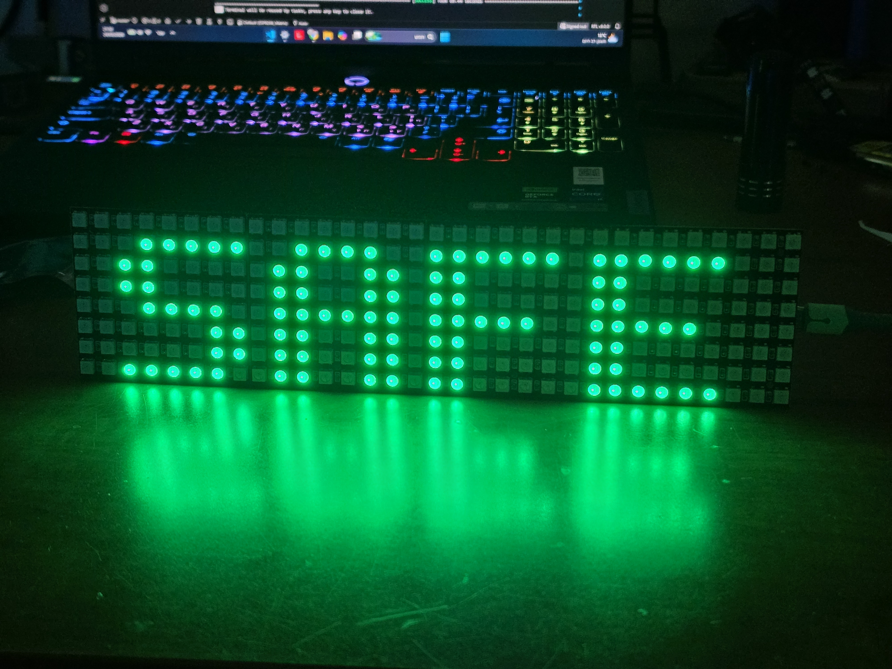
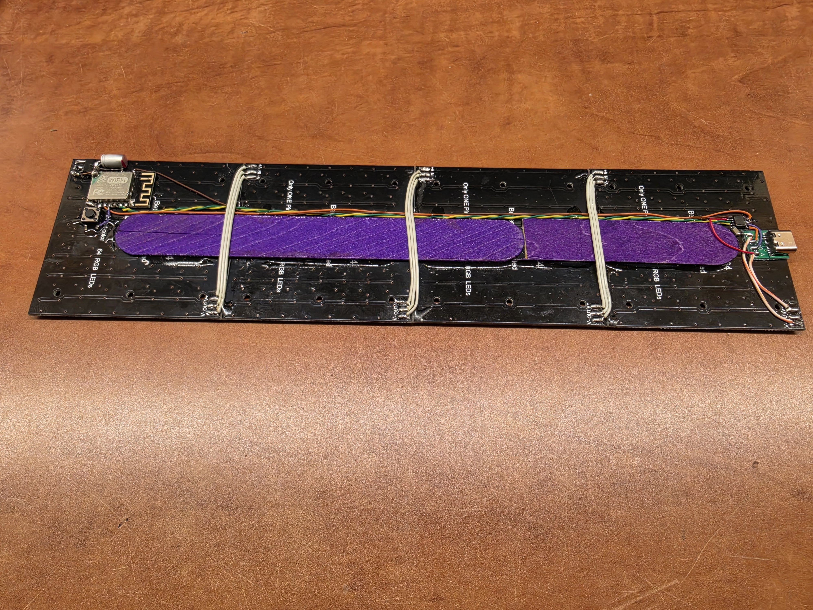
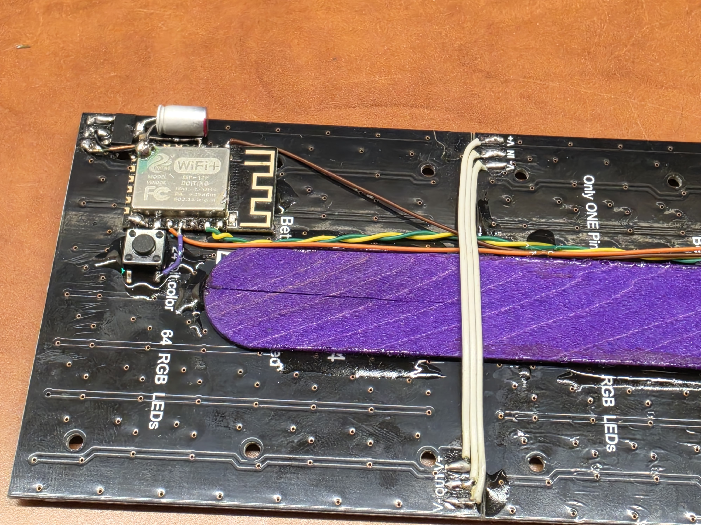
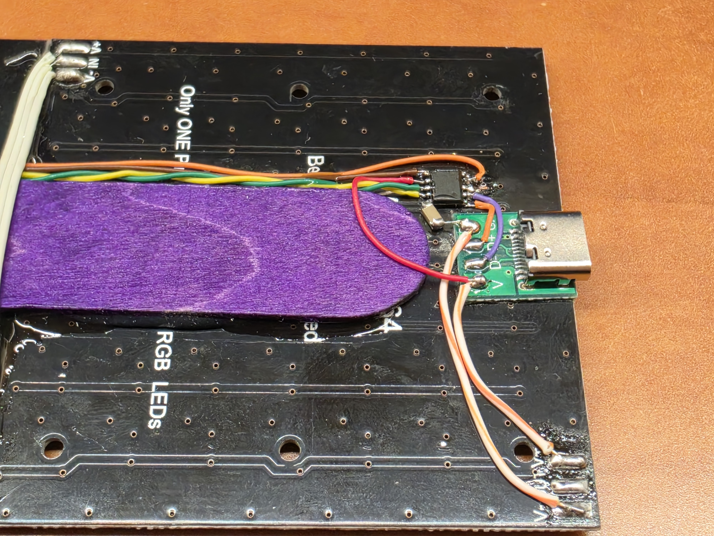

# 🚨 ESP8266 Oref Alert Matrix

A standalone **Israeli Home Front Command (Pikud HaOref)** real-time alert monitor displayed on a 32×8 WS2812B LED matrix, powered by an ESP8266.

No Home Assistant, no external server — just plug in and it works.



---

## ✨ Features

- **Real-time alerts** — polls the official Oref API every 3 seconds
- **City-specific filtering** — only alerts relevant to your city
- **Visual alert states** — color-coded scrolling/flashing text
- **WiFi setup via captive portal** — no code changes needed
- **Config button** — long-press to re-enter setup mode
- **20-minute safety timeout** — auto-returns to SAFE if API goes quiet

---

## 🖥️ Alert States

| State | Display | Color | Enter when | Exit when |
|-------|---------|-------|-----------|-----------|
| **SAFE** | `SAFE` static | 🟢 Green | No active alerts | Alert received |
| **PRE ALARM** | `PRE ALARM` scrolling | 🟠 Orange | Incoming threat (cat 10) for your city | Alert upgraded or cancelled |
| **ALARM** | `ALARM` flashing | 🔴 Red | Active alert in your city | Alert ends → UNSAFE |
| **UNSAFE** | `UNSAFE` scrolling | 🔴 Red | Alert ended (was ALARM/PRE ALARM) | Oref sends explicit all-clear (`הסתיים`) for your city, or 20-min safety timeout |
| **NO API** | `NO API` scrolling | 🔵 Blue | 5+ consecutive API failures | API recovers |
| **BAD CITY** | `BAD CITY` scrolling | 🟣 Magenta | City name not configured | Configure via portal |

---

## 🔧 Hardware

| Component | Details |
|-----------|---------|
| Microcontroller | ESP8266 (ESP-12E / NodeMCU / Wemos D1) |
| LED Matrix | 4× WS2812B 8×8 panels connected in series |
| Display size | 32×8 pixels |
| Button | Momentary push button (optional) |

### Wiring

```
ESP8266 GPIO5  ──────►  LED Matrix DIN  (data)
ESP8266 GPIO4  ──────►  Button  ──────►  GND  (config, optional)
ESP8266 3.3V / 5V  ──►  LED Matrix VCC
ESP8266 GND  ─────────  LED Matrix GND
```

> ⚠️ **Power note:** 256 WS2812B LEDs at full brightness can draw up to 15A.
> Use a dedicated 5V power supply and connect GND to the ESP8266.

### Physical Matrix Orientation

The four 8×8 panels are mounted **side by side**, each rotated **90° clockwise**,
with the USB connector on the **right side** of the assembled display.

```
┌────────┬────────┬────────┬────────┐
│        │        │        │        │
│ Panel0 │ Panel1 │ Panel2 │ Panel3 │  ← 32 pixels wide
│        │        │        │        │     8 pixels tall
└────────┴────────┴────────┴────────┘
                                   [USB]
```

### Assembly Photos

| Back — full assembly | Back — ESP8266 & button | Back — USB connector |
|:---:|:---:|:---:|
|  |  |  |

---

## 🚀 Setup

### 1. Install dependencies

Using [PlatformIO](https://platformio.org/):

```bash
pio run
```

Required libraries (defined in `platformio.ini`):
- `fastled/FastLED`
- `tzapu/WiFiManager`
- `bblanchon/ArduinoJson`

### 2. Flash the firmware

```bash
pio run --target upload
```

### 3. First-time WiFi configuration

1. Power on the device — all LEDs light up **blue**, then `...` → `WIFI`
2. On your phone, connect to the WiFi network **`RedAlert-Setup`**
3. A configuration page opens automatically
4. Enter your **WiFi credentials** and **city name in Hebrew** (e.g. `תל אביב`)
5. Save — the device connects and shows green `OK`

### 4. Done!

The device will show **`SAFE`** in green and start monitoring.

---

## 🔘 Config Button (GPIO4)

| Action | Result |
|--------|--------|
| **Hold 3 seconds** | Restarts and opens `RedAlert-Setup` portal again |

Connect a momentary button between **GPIO4** and **GND**.
Change `BUTTON_PIN` in `main.cpp` if using a different GPIO.

---

## ⚙️ Configuration

Edit the defines at the top of `src/main.cpp`:

```cpp
#define DATA_PIN    5      // GPIO for LED matrix data
#define BRIGHTNESS  20     // 0–255 (careful with power draw)
#define BUTTON_PIN  4      // GPIO for config button
```

---

## 📡 API

Polls the official Israeli Home Front Command API:

```
GET https://www.oref.org.il/warningMessages/alert/Alerts.json
```

- **Interval:** every 3 seconds
- **City matching:** bidirectional substring search (Hebrew)
- **SSL:** enabled (certificate verification skipped for compatibility)

---

## 🏗️ Project Structure

```
ESP8266_Matrix/
├── src/
│   └── main.cpp        # All application logic
├── platformio.ini      # Build configuration
└── README.md
```

---

## 📄 License

Apache License 2.0 — Copyright 2026 amir684

---

## 🙏 Inspiration

Based on the original [ESP32-C3 Red Alert](https://github.com/amir684/esp32c3-red-alert) project,
ported and adapted for ESP8266 with a WS2812B LED matrix display.
